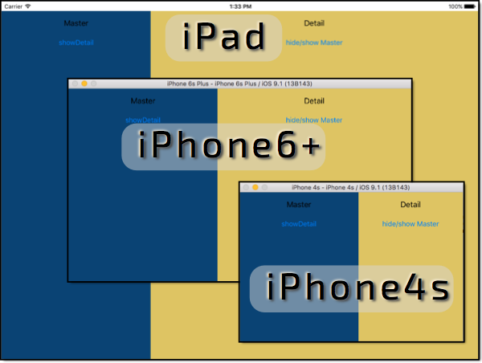
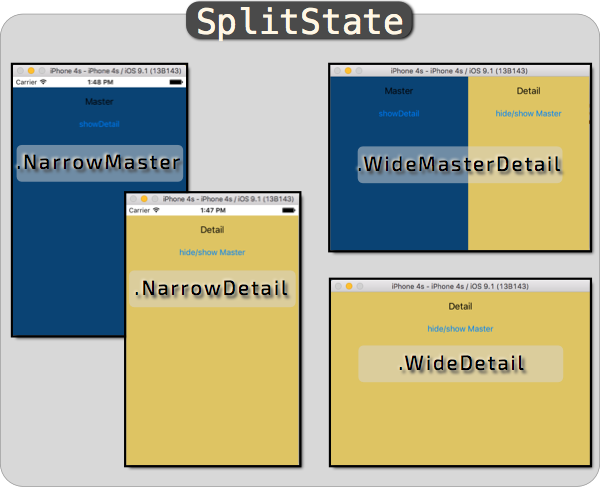

## AnimatingSplitViewController

This project has 2 examples (Targets/Apps) of using the AnimationSplitViewController. This is more of
a demonstration of a concept than a widget to plug in to an App.

AniSplitView - Has constraints created in code. Not recommended, but kinda cool because it configures itself.
AniSplitViewSimple - The constraints must be set in IB and the IBOutlets set for the views and 3 primary constraints.

This exploration was motivated when I ran into difficulty customizing a UISplitViewController and realize that
it is not very flexible and might not be the correct choice if you do not like the default behavior. Key features I wanted include:

 - Split available on all iPhones in Landscape.
 - No UINavigationController header for detail.
 - Split without overlay on iPad.
 - Play nicely with iOS9 iPad SlideOver and SplitView.

A movie best demonstrates some of these features:

### AniSplitViewSimple
Rather than build constraints in code, this project has them set in IB. This is the way I intend to use this code.
The two key views (masterView and detailView) as well as the 3 Key Constraints are set as @IBOutlets. This removes
the need for the setupConstraints() method which is the most confusing and complex (and problematic?) part of this. 
Also, the hack(?) to find the masterView and detailView is avoided.

### Notes on UISplitViewController

 - Seems a bit strange
 - Does not follow size classes
 - Requires UINavigationControllers
 - Semi custom Push Detail Segue
 - Hard to customize

## AniSplitView

Usage in IB:
1) Add a view controller, set as a AnimatingSplitViewController.
1) (Optional, but expected) Add plain UIView as a container if you want to contain the split view.
1) Drag in 2 Container views.
1) Have one implement AnimatingSplitMasterViewController (var splitDelegate:AnimatingSplitViewControllerDelegate!).
1) Have one implement AnimatingSplitDetailViewController (var splitDelegate:AnimatingSplitViewControllerDelegate!).
1) Code Master and Detail with calls to AnimatingSplitViewControllerDelegate as desired.

Possible enhancements:
 - Add SplitState WideMaster, to enable a full screen master mode.
 - Custom transitions, or match UISplitViewController transitions.
 - Package in library. Well beyond scope of this work.
 - 
